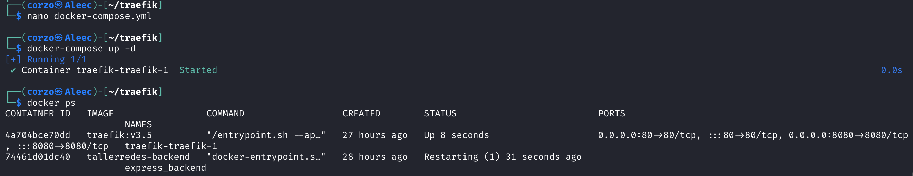
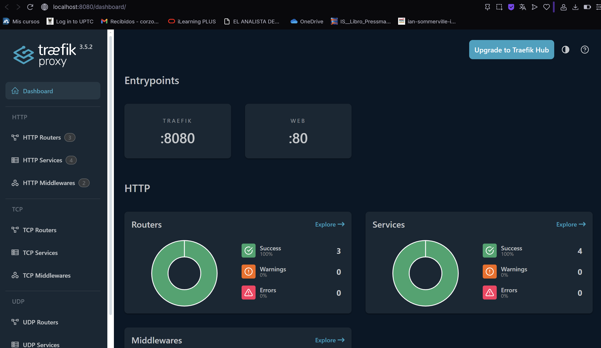
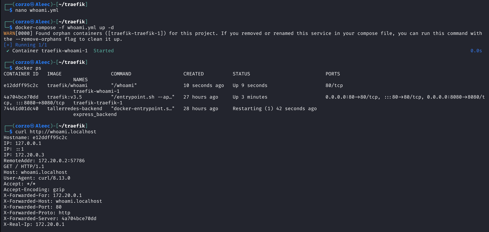
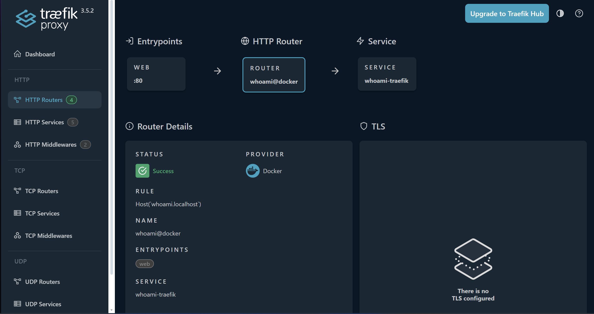

# Traefik

## Actividad: Introducción a Traefik con Docker

### 1. ¿Qué ventaja aporta enrutar por host (dominio) vs por puerto?
El enrutar por el host permite poder acceder a varios servicios usando el mismo puerto y poder diferenciarlos por el dominio o por el subdominio. Esto ayuda a que sea más fácil de manejar y tratar y facilita la escalabilidad
Por otro lado, enrutar por puerto obliga a exponer un puerto diferente por cada servicio, lo cual hace que no escale bien.

### 2. ¿Qué diferencia hay entre labels en los servicios y usar archivos de configuración?
- **Labels en los servicios**: Se definen en el `docker-compose.yml` o en la definición del contenedor. Son dinámicos y permiten que Traefik descubra y configure automáticamente los servicios.
- **Archivos de configuración**: Se guardan en ficheros externos (`traefik.toml`, `traefik.yml`). Son más apropiados para reglas complejas o configuraciones estáticas centralizadas.

### 3. ¿Cómo se entera Traefik de que había servicios nuevos?
Traefik utiliza los **providers** para detectar cambios. Con Docker, se conecta al socket de Docker y escucha los eventos de los de contenedores. De esta manera configura automáticamente los nuevos servicios que tengan labels.

## Evidencias

